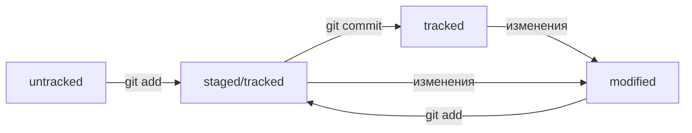

# Шпаргалка по Git для начинающих
---
В данном файле содержится короткое описание информации котрую я изучил на курсе ["Основы работы с Git"](https://practicum.yandex.ru/git-basics/) на данный момент.

> *Кто хочет научиться летать, тот должен сперва научиться стоять, и*
> *ходить, и бегать, и лазить, и танцевать: нельзя сразу научиться* 
> *полету!* (c) Ф. Ницше

---
## Начало работы с Git (Локальный репозиторий)
Для начала установите систему контроля версий Git на ваше устройство.

### 1. Инициализация репозитория
Для инициализации репозитория нужо в папке с проектом (или в папке где этот проект будет) открыть терминал(командную строку) и выполнить команду:
```bash
git init
```

### 2. Удаление репозитория
Для удаления репозитория(фактически это скрытая папка с файлами git'а) нужно в папке с проектом отерыть терминал(командную строку) и выполнить команду:
```bash
rm -rf .git
```

### 3. Проверка состояния репозитория
Для проверки состояния репозитория нужно в папке с проектом отерыть терминал(командную строку) и выполнить команду:
```bash
git status 
```

### 4. Добавление отслеживаемых файлов
Для добавления файла в список отслеживаемых git'ом нужно в папке с проектом отерыть терминал(командную строку) и выполнить команду:
```bash
git add <название файла> (--all - все файлы в каталоге)
```

### 5. Сохранение изменений отслеживаемых файлов (комит)
Для того чтобы сохранить изменения в отслеживаемых файлах (сделать комит) нужно в папке с проектом отерыть терминал(командную строку) и выполнить команду:
```bash
git commit (-m 'строка описывающая изменения'/если без флага то откроется текстовый редактор) 
```

### 6. просмотр истории комитов
Для просмотра истории комитов нужно в папке с проектом отерыть терминал(командную строку) и выполнить команду:
```bash
git log
```

---
## Удаленный репозиторий 
Для работы в команде(когда над проектом одновременно могут работать несколько человек) или из разных мест удобно использовать удаленный репозиторий (можно сделать самому). Существуют несколько сервисов предоставляющих подобные услуги (GitHub, GitLab, GitFlic(russia), Gogs(china) и т.п.) Как правило большинство использует GitHub но впрниципе они все аналогичны друг другу. Для безопасной работы нужна крипторгафия ssh ключи.

### 1. Создание SSH пары ключей
В терминале нужно ввести команду для генерации ключей:
1. С использованием актуального алгоритма шифрования
```bash
ssh-keygen -t ed25519 -C "электронная почта, к которой привязан ваш аккаунт" 
```
2. На устаревших системах 
```bash
ssh-keygen -t rsa -b 4096 -C "электронная почта, к которой привязан ваш аккаунт" 
```

Далее потребуется следуйте инструкциям выводимым программой: предложат указать местоположение, имя ключей (можно оставить по умаолчанию) и кодовую фразу(passphrase) - фактически это небольшой пароль для использования ssh пары.

### 2. Привязываем SSH ключ к удаленному аккаунту(в данном случае GitHub)
1. В папке в которую сохранили пару ключей (по-умолчанию : ~/.ssh) находим файлы id_ed25519/id_rsa и id_ed25519.pub/id_rsa.pub (в зависимости от выбранного ранее алгоритма)
2. Копируем содержимое файла с расширением .pub в специализированное поле в своем аккаунте сервиса для удаленного репозитория

### 3. Привязывание уаленного репозитория к локальному
Открыв терминал в каталоге с проеком(локальным репозиторием) нужно ввести команду 
```bash
git remote add origin <ссылка на удаленный репозиторий>
git remote add origin git@github.com:%ИМЯ_АККАУНТА%/first-project.git 
```
После этого можно проверить успешность операции командой:
```bash
git remote -v
```
Пример ответа на команду:
```bash
$ git remote -v
origin    git@github.com:%ИМЯ_АККАУНТА%/%ИМЯ-ПРОЕКТА%.git (fetch)
origin    git@github.com:%ИМЯ_АККАУНТА%/%ИМЯ-ПРОЕКТА%.git (push) 
```

### 4. Синхронизирование локального и удаленного репозиториев
Открыв терминал в каталоге с проеком(локальным репозиторием) нужно ввести команду 
```bash
git push
```
### 5. Файл README.md
Как правило, в README.md проекта можно найти следующую информацию:
1. Название проекта и его краткое описание: кем создан, для чего, какие решает задачи и какие закрывает проблемы.
2. Технологии, которые применяются в проекте. В чём его отличие от аналогичных.
3. Документация проекта — подробная инструкция о том, что представляет собой проект.
4. Планы проекта, если они есть.

Информацию по синтаксису можно найти на в [шпаргалке на GitHub](https://gist.github.com/fomvasss/8dd8cd7f88c67a4e3727f9d39224a84c#code) или в [этом гайде](https://www.markdownguide.org/cheat-sheet/).

---
## Навигация по коммитам. Статусы файлов
### 1. Хеш — идентификатор коммита
**Хеш — основной идентификатор коммита**.

Обычно хеш — это короткая (40 символов в случае SHA-1) строка, которая состоит из цифр 0—9 и латинских букв A—F (неважно, заглавных или строчных). Она обладает следующими важными свойствами:

- если хеш получить дважды для одного и того же набора входных данных, то результат будет гарантированно одинаковый;
- если хоть что-то в исходных данных поменяется (хотя бы один символ), то хеш тоже изменится (причём сильно).

Git хранит таблицу соответствий хеш → информация о коммите. Если вы знаете хеш, вы можете узнать всё остальное: автора и дату коммита и содержимое закоммиченных файлов. Можно сказать, что хеш — основной идентификатор коммита.

При работе с Git хеши будут встречаться вам регулярно. Их можно будет передавать в качестве параметра разным Git-командам, чтобы указать, с каким коммитом нужно произвести то или иное действие.

Все хеши и таблицу хеш → информация о коммите Git сохраняет в служебные файлы. Они находятся в скрытой папке .git в репозитории проекта.

### 2. Исследуем лог
После вызова команды 
```bash
git log
```
В терминал выводится список коммитов, для каждого комита содержится следующая информация:
- строка из цифр и латинских букв после слова commit — это хеш коммита;
- Author — имя автора и его электронная почта;
- Date — дата и время создания коммита;
- в конце находится сообщение коммита.

Получить сокращённый лог можно с помощью команды git log с флагом --oneline (англ. «одной строкой»). 
```bash
git log --oneline
```
Сокращённый лог полезен, если в репозитории уже много коммитов — например, сотни или тысячи. В этом случае можно быстро найти нужный по описанию.(Сокращённый хеш (то есть первые несколько символов полного) можно использовать точно так же, как и полный. Для этого команда git log --oneline автоматически подбирает такую длину сокращённых хешей, чтобы они были уникальными в пределах репозитория и Git всегда мог понять, о каком коммите идёт речь.)

### 3. HEAD — всему голова
Файл HEAD (англ. «голова», «головной») — один из служебных файлов папки .git. Он указывает на коммит, который сделан последним (то есть на самый новый).

Внутри HEAD — ссылка на служебный файл: refs/heads/master (или refs/heads/main в зависимости от названия ветки). Если заглянуть в этот файл, можно увидеть хеш последнего коммита.

При работе с Git указатель HEAD используется довольно часто. Мы уже упоминали, что многие команды Git принимают в качестве параметра хеш коммита. Если нужно передать последний коммит, то вместо его хеша можно просто написать слово HEAD — Git поймёт, что вы имели в виду последний коммит.

### 4. Статусы файлов в Git
Одна из ключевых задач Git — отслеживать изменения файлов в репозитории. Для этого каждый файл помечается каким-либо статусом. Рассмотрим основные.

- untracked (англ. «неотслеживаемый»)
Мы говорили, что новые файлы в Git-репозитории помечаются как untracked, то есть неотслеживаемые. Git «видит», что такой файл существует, но не следит за изменениями в нём. У untracked-файла нет предыдущих версий, зафиксированных в коммитах или через команду git add.

- staged (англ. «подготовленный»)
После выполнения команды git add файл попадает в staging area (от англ. stage — «сцена», «этап [процесса]» и area — «область»), то есть в список файлов, которые войдут в коммит. В этот момент файл находится в состоянии staged.

- tracked (англ. «отслеживаемый»)
Состояние tracked — это противоположность untracked. Оно довольно широкое по смыслу: в него попадают файлы, которые уже были зафиксированы с помощью git commit, а также файлы, которые были добавлены в staging area командой git add. То есть все файлы, в которых Git так или иначе отслеживает изменения.

- modified (англ. «изменённый»)
Состояние modified означает, что Git сравнил содержимое файла с последней сохранённой версией и нашёл отличия. Например, файл был закоммичен и после этого изменён.

Для файлов в состояниях staged и modified обычно не указывают, что они также tracked, потому что это состояние подразумевается. Команда git add добавляет в staging area только текущее содержимое файла. Если вы, например, сделаете git add file.txt, а затем измените file.txt, то новое содержимое файла не будет находиться в staging.
Git сообщит об этом с помощью статуса modified: файл изменён относительно той версии, которая уже в staging. Чтобы добавить в staging последнюю версию, нужно выполнить git add file.txt ещё раз.

#### Типичный жизненный цикл файла в Git


1. Файл только что создали. Git про него ещё ничего не знает. Состояние: untracked.
2. Файл добавили в staging area с помощью git add. Состояние: staged (+ tracked).
    - Возможно, изменили файл ещё раз. Состояния: staged, modified (+ tracked).
    Обратите внимание: staged и modified у одного файла, но у разных его версий.
    - Ещё раз выполнили git add. Состояние: staged (+ tracked).
3. Сделали коммит с помощью git commit. Состояние: tracked.
4. Изменили файл. Состояние: modified (+ tracked).
5. Снова добавили в staging area с помощью git add. Состояния: staged (+ tracked).
6. Сделали коммит. Состояния: tracked.
7. Повторили пункты 4-7 много-много раз.

### 5. Как читать git status
Частая ошибка при использовании Git — закоммитить лишнее или, наоборот, забыть добавить важный файл в коммит. Этого легко избежать, если не забывать проверять статусы файлов с помощью команды git status.

## Работа над ошибками в коммитах
### 1. Оформление сообщений к коммитам
То, как написаны сообщения коммитов, тоже может подчиняться определённым правилам. Иногда эти правила продиктованы культурой команды, а иногда техническими ограничениями.

Например, в выводе команды git log --oneline умещается максимум 72 первых символа сообщения, поэтому многие правила включают пункт: «Сообщение не должно быть длиннее 72 символов».

Есть общие рекомендации по тому, как правильно составить сообщение. Оно должно быть:
- относительно коротким, чтобы его было легко прочитать;
- информативным. 

Вот пример полезного сообщения в репозитории новостного сайта: Исправление опечатки в заголовке главной страницы на хорватском. Такое сообщение даёт много информации:
- Исправление опечатки значит, что исправлена ошибка, которая была допущена при наборе. Такое исправление не меняет смысл. То есть, например, главному редактору не нужно перепроверять этот заголовок.
- На хорватском говорит о том, что переводчикам на другие языки этот коммит можно смело пропускать.
- В заголовке главной страницы указывает, где произошли изменения. Если, например, кто-то зайдёт на сайт и ему не понравится новый заголовок, он легко найдёт по истории (git log) автора этого коммита и спросит у него, почему заголовок теперь такой.

#### Стили оформления
Без единообразия коммитов нет и эффективной работы в Git. Это может показаться мелочью, но когда коммиты с сообщениями в разных стилях идут друг за другом, их может быть сложно читать.

Например, правила могут быть такие:
- длина сообщения от 30 до 72 символов;
- первое слово — глагол в инфинитиве («исправить», «дополнить», «добавить» и другие);
- и так далее.

### 2. Добавление изменений в последний коммит
Добавляет изменения к последнему коммиту и оставляет сообщение прежним;
```bash
git commit --amend --no-edit
```

Изменяет сообщение к последнему коммиту на "Новое сообщение".
```bash
git commit --amend -m "Новое сообщение"
```

### 3. «Откат» файлов и коммитов
 restore (от англ. restore, «восстановить») — переводит файл hello.txt из состояния staged обратно в untracked или modified;
```bash
git restore --staged hello.txt
```

Возвращает файл hello.txt к последней версии, которая была сохранена через git commit или git add;
```bash
git restore hello.txt
```

reset (от англ. reset, «сброс», «обнуление» + hard, «суровый») — удаляет все незакоммиченные изменения из staging и «рабочей зоны» вплоть до указанного коммита.
```bash
git reset --hard b576d89
```

### 4. Просмотр изменений
diff (от англ. difference, «отличие», «разница») — показывает изменения в «рабочей зоне», то есть в modified-файлах;
```bash
git diff
```

Выводит разницу между двумя коммитами;
```bash
git diff a9928ab 11bada1
```

Покажи изменения, которые добавлены в staged-файлах.
```bash
git diff --staged
```
